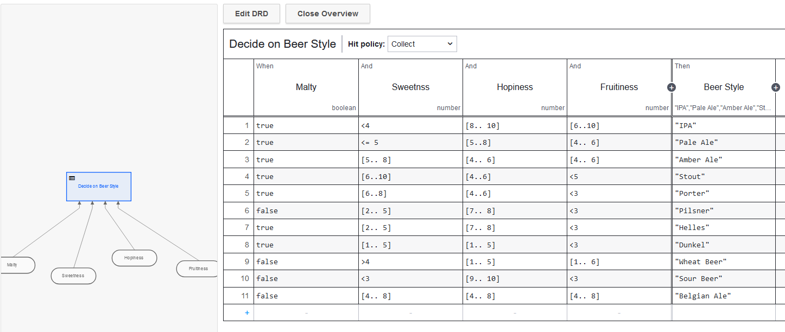
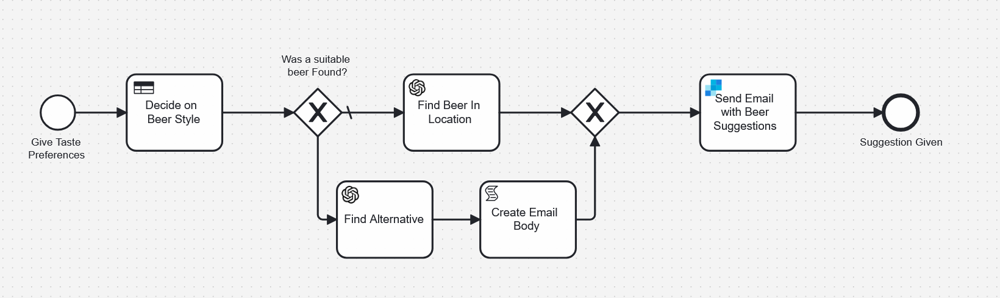

# Beer Suggestion Process

This is a process that uses BPMN, DMN and some AI to suggest a beer you should try based on your location and preference.

The DMN table to decide what kind of beer style you might like looks like this

This table is integrated into a BPMN model that adds a front end for users to add information as well as a connection to ChatGPT so that we can suggest somewhere for you to get the beer you so richly deserve

It'll even send you an email with a suggestion.

## Setup Required

This example requires a little bit of setup. You will need a Camunda 8 account (the easiest place to do that is [Camunda SaaS](https://signup.camunda.com/accounts)). You will also need to create a [SendGrid](https://sendgrid.com/en-us) account and you need to create a [ChatGPT](https://chatgpt.com/) account. Then, you need to get an API key for both services.

## Setting up Secrets

🔐 It’s important to know that it’s best practice not to simply copy and paste this sensitive information directly into the model but rather to [create a secret](https://docs.camunda.io/docs/components/console/manage-clusters/manage-secrets/) for each of these in your Camunda cluster. Then you can reference it by typing `{{secrets.yourSecretHere}}` followed by the name of the key you want to access.

For this example to work you'll need to create secrets with the following names:

- OpenAI
- SendGrid

## How to Deploy it

Once you have both accounts, it's pretty easy to get started. Upload the BPMN model, the DMN Model and the Form to your Camunda 8 account. From the modeler you can deploy the process to a cluster.

You can start the process from the Modeler or from Tasklist.
